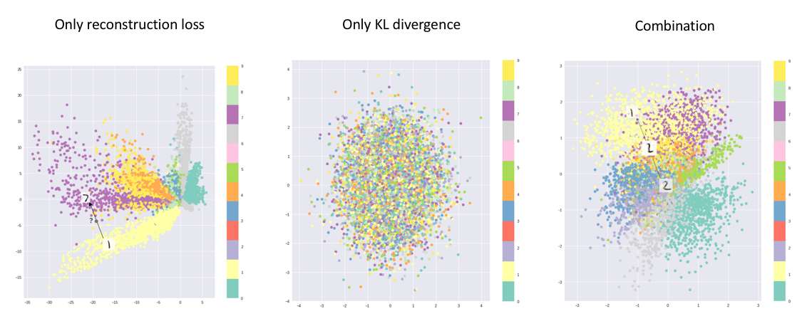

# Generative AI Curriculum

- Review of previous day
	- Highlight the encoding  stream in, for example, image classification
		- From high-dimensional input (many pixels) to low-dimensional summary (most likely class)
		- Dimensionality reduction
		- This is an example of compression
	- Today: Opposite direction: From low-dimensional description to image
		- Low-dimensional vector: the "code"
		- From image to code: encoder
		- From code to image: decoder
	- Why?
		- Data augmentation / synthesis
		- Denoising: in medical domain, generating high-quality images (e.g,. MRI, X-ray) can be slow or harmful (dose). Idea: consider noisy images as "code" and use them to generate the "corresponding" high-quality image 

- Autoencoder
	- Let's assume we just have a bunch of images (no labels)
	- Q: How to learn a generator?
	- A: Learn (encoder, decoder) pair that is able to compress an image into a latent and then reconstruct the original image as closely as possible
	- Exercise:
		- http://adl.toelt.ai/Autoencoders/Your_first_autoencoder_with_Keras.html
		- Train autoencoder on MNIST
		- Plot the latent space representation of the test digits
			- Use principal component analysis to project to 2D
			- Did the autoencoder learn to cluster the classes? (without having been told about them)
			- Maybe train linear classifier on code
		- Encode two different digits, interpolate the encodings, decode
		- Encode an image, apply some noise, decode
			- Q: How "stable" is the learned code
		- Outlier detection / anomaly detection
		- Information retrieval:
			- Image reverse search (Google; given an image, try to find similar images)
	- Influencing the structure of the code
		- Enforce sparsity (e.g., keep only k-largest components of code vectors, add norm of code vector to loss function)

- Semi-supervised learning
	- Yesterday: supervised learning: required labeled images
	- Autoencoder: unsupervised learning: no labels required
		- Learn structure of data
	- Semi-supervised learning / weak supervision: Learned encodings can be used as basis for supervised learning
	 - Examples
		 - Linear classifier on pixel values vs. linear classifier on code (proposed exercise for autoencoders)
		 - KNN-clustering on latent codes

- Variational autoencoder
	- Deterministic autoencoder: trained to map one image onto one code, such that this code can be mapped back to the original image.
		- How to generate **new** images that haven't been seen before?
		- Modifying the code of an image and then decoding it produces XX
	- Variational autoencoder:
		- Input images is not encoded into / mapped onto a single point
		- Instead: Image is mapped onto a distribution over "codes" (in the latent space)
		- Sampling from this distribution and then decoding them should produce samples over similar images
		- Constraints on the code (see note about sparsity for deterministic autoencoder) are defined by a prior distribution
	- Exercises
		- http://adl.toelt.ai/VAE/Variational_Autoencoders.html
		- TODO: What to do beyond running the script?
		- Maybe compare against deterministic autoencoder with 2D latent space

from https://towardsdatascience.com/intuitively-understanding-variational-autoencoders-1bfe67eb5daf

- Generative adversarial networks
	- Variational autoencoder is trained such that samples from code distribution, when decoded, produce images which are similar to the input image.
		- Similarity is defined via the "reconstruction error" loss term
		- This is typically the mean squared error
		- As a result: Generated images are often blurry
	- GANs as an **adversarial** game between two players
		- Generator: converts (random) code into image
		- Discriminator is given two images: a "real" one and a sample from the generator. It has to decide which of the two is real.
		- Both networks are trained simultaneously:
			- Generator is optimized to fool the discriminator as frequently as possible
			- Discriminator is optimized to be fooled as rarely as possible
		- In the end (ideally):
			- Very sensitive discriminator
			- Generator that can generate images that look are real as possible
	- GANs are challenging to train
		- Vanishing gradient: If the discriminator is too good compared to the generator: no matter how the generator is changed, the loss will decrease only minimally. As a result, the gradient vector has small magnitude. The discriminator is stuck.
		- Mode collapse: If the generator is learning faster than the discriminator: Identify the weak spot of the discriminator (e.g., digit zero), then only generate this digit. 
	- Examples
		- Progressive GAN
			- From small images to larger images ("curriculum learning" to address challenges in training GANs for image generation)
		- StyleGAN series
			- Progressive GAN + neural style transfer
			- StyleGAN 1:
				- Generator:
					- Latent code is passed through a fully connected network to generate parameters for "adaptive instance normalization" (AdaIN; per channel mean and standard deviation)
					- Image is generated from a constant 4x4x512 "tensor" by applying (scaled) noise, adaptive instance normalization, and convolutions, and bilinear upsampling
				- Style mixing:
					- Take two different latent codes and generate corresponding AdaIN parameters.
					- Take one set of parameters for "early stages" (low resolution). This defines the "what".
					- Take other set of parameters for "late stages" (high resolution). This defines the "how" or "style".
	- Exercises:
		- TODO

- Image-text
	- Imaging captioning
		- TODO
		- Exercises:
			- No existing exercises?
		- KerasCV example: https://keras.io/examples/vision/image_captioning/
	- Detour to GPT (auto-regressive text token transformers)
		- Explain roughly how they work
		- Goal: Give impression of how text embeddings can be generated
	- Image-text matching
		- CLIP (Radford et al. 2021)
		- Learning image representations from text
		- Zero-shot performance on ImageNet matches ResNet (without making use of the ImageNet training data)
	- Diffusion models
		- Text-conditional diffusion model: Dall-E 2
		- Exercises:
			- Focus on scalar output
			- Example: https://www.kaggle.com/code/grishasizov/simple-denoising-diffusion-model-toy-1d-example
			- Ideally:
				- Convert this to Keras
				- Use not just a uni-modal target distribution (x_0 = -5 in the above example), but a bi-modal target distribution (say p(x_0 = -5) = 0.5 and p(x_0 = +5) = 0.5)
					- The denoising processing should converge onto either of these two values with probability of 50%
				- Extend to conditional diffussion / denoising
					- Student can specify onto which mode the denoising process converges

